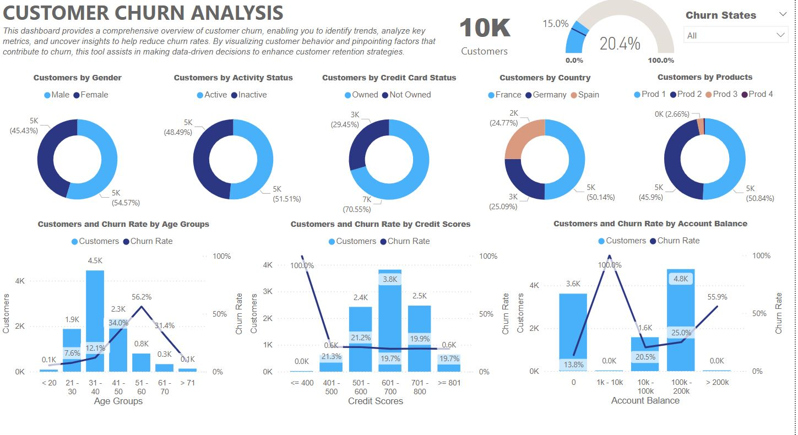

# Customer Churn Analysis Dashboard

This repository contains a Power BI dashboard designed for Customer Churn Analysis. The dashboard provides insightful visualizations to help understand and reduce customer churn by analyzing various factors such as demographics, account balances, credit scores, and product usage.



## Dashboard Overview

### Key Features:
- **Total Customers**: Displays the total number of customers analyzed.
- **Churn Rate**: Shows the overall churn rate percentage, helping you understand the proportion of customers who have stopped using the service.
- **Churn States Filter**: Allows filtering the analysis based on different churn states.

### Visualizations:
1. **Customers by Gender**: Pie chart showing the distribution of customers by gender.
2. **Customers by Activity Status**: Pie chart depicting the active and inactive customer segments.
3. **Customers by Credit Card Status**: Pie chart displaying customers based on credit card ownership.
4. **Customers by Country**: Pie chart illustrating the geographical distribution of customers.
5. **Customers by Products**: Pie chart showing the distribution of customers across different products.
6. **Customers and Churn Rate by Age Groups**: A bar and line chart displaying customer count and churn rate across different age groups.
7. **Customers and Churn Rate by Credit Scores**: A bar and line chart representing customer distribution and churn rate by credit scores.
8. **Customers and Churn Rate by Account Balance**: A bar and line chart analyzing how account balance impacts customer churn.

## How to Use

1. **Clone the Repository**:
   ```bash
   git clone https://github.com/your-username/churn-analysis-dashboard.git

   ## Open the Dashboard:

  - Open the `.pbix` file in Power BI Desktop to view and interact with the dashboard.
  - Alternatively, you can upload the file to Power BI Service for online access and sharing.

2. **Filter and Explore:**

  - Use the filters provided to analyze specific segments or variables.
  - Hover over the charts for detailed insights.

3. **Insights and Actions**
   
  - **Identify High-Risk Groups**: By analyzing age groups, credit scores, and account balances, you can identify which customer segments are at higher risk of churn.
  - **Targeted Retention Strategies**: Use the insights to design targeted interventions for customers who are more likely to churn.
  - **Product Improvement**: Understanding customer preferences and churn reasons can help in refining product offerings.

## Contributing

Feel free to fork this repository and submit pull requests if you'd like to improve the dashboard or add new features.

## License

This project is licensed under the MIT License - see the [LICENSE](LICENSE) file for details.

